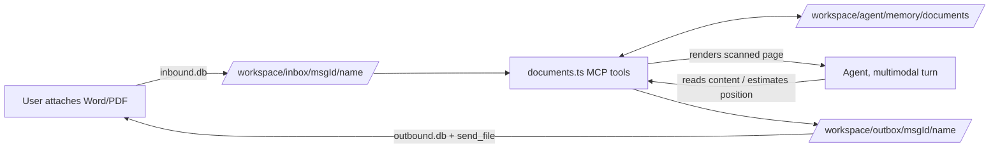

> **Canonical contract.** This spine and its companions are the complete, preservation-validated contract for what to build. `[ASSUMPTION]` tags are fast-path calls for the user to confirm or correct in review.

# Architecture Spine — Document Memory + Fill-In Editing

## Design Paradigm

No new paradigm. This feature composes onto NanoClaw's existing shape: a host Node process and a per-agent-group Docker container communicating only through two mounted SQLite DBs and mounted filesystem trees (inbox/, outbox/, memory/); inside the container, capabilities are exposed to the agent as MCP tools. This feature adds one new MCP-tool file and one new agent-facing prose skill — no new communication path, no new runtime.



## Invariants & Rules

### AD-1 — New MCP tools follow the existing registration convention

- **Binds:** CAP-1, CAP-2, CAP-3
- **Prevents:** a second, incompatible way of exposing tools to the agent (bespoke server wiring, ad hoc dispatch)
- **Rule:** `[ADOPTED]` New tools (`save_document`, `list_documents`, `fill_document_field`) are `McpToolDefinition` exports in a new `container/agent-runner/src/mcp-tools/documents.ts`, registered via `registerTools([...])` at module scope, wired into the agent by adding one `import './documents.js';` line to the `mcp-tools/index.ts` barrel — same shape as `core.ts` and `transcribe-audio.ts`.

### AD-2 — Document work runs synchronously in-container, not via the host fire-and-forget pattern

- **Binds:** CAP-1, CAP-2, CAP-3
- **Prevents:** an unnecessary async round-trip (tool call → host action → fresh inbound message → agent reacts again) for work that needs no external API or credential
- **Rule:** All parsing, extraction, and writing happens inside the MCP tool's own handler, in-container (Bun), during the same turn. The host fire-and-forget pattern (`transcribe-audio.ts`'s shape: write a `system` outbound row, let the host do the work, deliver a later inbound message) is reserved for work that genuinely needs the host — this feature doesn't.

### AD-3 — Docx/PDF libraries are base-image dependencies, not per-group opt-in

- **Binds:** CAP-1, CAP-3
- **Prevents:** the feature working for some agent groups but not others, and confusing it with the unrelated `install_packages` self-mod flow (which builds a *derived*, per-group image)
- **Rule:** `[ADOPTED]` `pdf-lib`, `pdfjs-dist`, `@hyzyla/pdfium`, and `jszip` are added to `container/agent-runner/package.json` `dependencies`, baked into the shared base image by the Dockerfile's existing `bun install --frozen-lockfile` layer — the same mechanism every current base dependency (`zod`, `cron-parser`, …) uses.

### AD-4 — PDF write path: form-field when present, overlay otherwise; read path is hybrid text-layer-or-vision

- **Binds:** CAP-1, CAP-3
- **Prevents:** any code path that parses and re-typesets PDF content (ruled out by SPEC.md); stamping text over a real AcroForm field instead of setting it (violates row-targeting-matrix.md's priority order and its "no page content redrawn" success condition for that branch); a second/competing OCR integration; a coordinate mismatch between what the agent estimated and what the tool draws
- **Rule:** Writing has two branches per `row-targeting-matrix.md`'s priority order: (1) if the PDF has an AcroForm field matching the target, `pdf-lib` sets the field's value via its native form API — no page content is redrawn; (2) otherwise, `pdf-lib` draws new text on top of the existing page and saves a new PDF — never reflow. Reading: if the PDF has a text layer, `pdfjs-dist` extracts text with per-item coordinates; if not, `@hyzyla/pdfium` renders the page to an image and the *agent's own multimodal turn* — not a tool-embedded OCR/vision call — reads content and estimates position from it. The tool, not the agent, owns the pixel→point conversion: it passes the agent the image's exact rendered pixel dimensions in the same turn (never lets the agent infer them, guarding against a multimodal API silently resizing the image first), then converts the agent's pixel estimate to PDF point-space using those known dimensions and the render scale it chose for `pdfium`.

### AD-5 — Word cell edits are direct OOXML manipulation, not templating

- **Binds:** CAP-3
- **Prevents:** reaching for a template-placeholder library (`docxtemplater`) that doesn't fit "edit an arbitrary existing document," a naive raw-string match that misses text Word has fragmented across multiple `<w:r>` runs, and disagreement over what "row 1" means
- **Rule:** `[ASSUMPTION]` `jszip` unzips the `.docx`, the target cell's runs are located and merged before matching, its text is replaced in `word/document.xml`, and the archive is rezipped. Everything else in the archive is untouched. Targeting is 1-indexed and matches `(table number, row number)` in natural reading order — table 1 is the first table in document order, row 1 is the first row including a header row if the table has one (a human reading the table aloud would call it row 1).

### AD-6 — Saved documents get a stable per-group home, independent of the ephemeral inbox

- **Binds:** CAP-1, CAP-2
- **Prevents:** relying on `inbox/` (message-scoped, not group-scoped) as long-term storage; `memory/index.md` bloating with full document text instead of a pointer; conflating this storage with the separate tenant-scoped second-brain pipeline (`src/media-ingestion.ts`), which SPEC.md and `brownfield.md` both explicitly warn not to reuse here
- **Rule:** The raw file is copied to `groups/<folder>/memory/documents/files/<slug>.<ext>` (`<slug>` per AD-10). One OKF concept file `groups/<folder>/memory/documents/<slug>.md` extends the existing `type`/`description` convention with two feature-specific keys — `source-filename`, `saved-date` — and holds the extracted text/summary plus a relative path back to the raw file. One line is appended to `memory/index.md` per saved document.

### AD-7 — Disambiguation data comes from a tool; the numbered list itself is the agent's

- **Binds:** CAP-2, CAP-3
- **Prevents:** two independently-built call sites picking a document differently (one auto-selecting "most recent," another asking) — SPEC.md requires the same numbered-pick-list behavior everywhere
- **Rule:** `list_documents` returns structured data (slug, filename, description) read from `memory/documents/*.md` frontmatter. Rendering that as a numbered pick-list and reading back the user's chosen number is the agent's own chat turn, not a tool responsibility.

### AD-8 — Failure is explicit, never a silent nearest-guess

- **Binds:** CAP-3
- **Prevents:** a wrong or approximate write landing silently in the returned document when the requested target doesn't actually exist
- **Rule:** When `fill_document_field` cannot resolve the named table/row/field/line, the handler returns this codebase's existing MCP-tool error shape (`{ content: [{ type: 'text', text: 'Error: …' }], isError: true }`, per `core.ts`'s `err()`) for the agent to relay — it never writes to an approximate or wrong location.

### AD-9 — Attachment naming completeness for docx/pdf

- **Binds:** CAP-1
- **Prevents:** a Word file that arrives without an explicit `att.name` from the channel bridge landing with no file extension, which breaks AD-6's `<slug>.<ext>` storage naming and AD-5's file-type routing before either ever runs
- **Rule:** `src/attachment-naming.ts`'s `MIME_TO_EXT` map gains `.docx`/`.doc` entries (it already has `application/pdf`) as a prerequisite fix landed alongside this feature, not a separate unrelated change.

### AD-10 — One shared slug-generation scheme

- **Binds:** CAP-1, CAP-2, CAP-3
- **Prevents:** `save_document` and `list_documents`/`fill_document_field` independently inventing different slugify logic, breaking cross-tool document references
- **Rule:** A single shared function (used by every tool in `documents.ts`, not reimplemented per tool) derives `<slug>` from the source filename: lowercase, kebab-case, strip extension; on collision with an existing `memory/documents/<slug>.md`, append `-2`, `-3`, … until unique.

### AD-11 — Concurrent writes to shared per-group memory are serialized

- **Binds:** CAP-1
- **Prevents:** two concurrent `save_document` calls (memory is per-agent-group, not per-session — two live sessions of the same group can run containers at once) racing on the same `memory/index.md` or `memory/documents/index.md`, corrupting or dropping an entry
- **Rule:** Every write to a shared memory index file goes through read-modify-write guarded by a file lock (or an equivalent atomic-append discipline) inside the tool handler — never an unguarded read-then-overwrite.

### AD-12 — Docx fill-in-the-blank text lines are a distinct targeting mode from table cells

- **Binds:** CAP-3
- **Prevents:** treating "no table matches" as a hard failure when the document is a real, common shape (a plain paragraph ending in a run of underscores or a label+colon blank) that a human would obviously call "fill this line" — discovered live in production use (real household forms), where table-based docx forms turned out to be the minority case, not the default assumed at spec time.
- **Rule:** When `fill_document_field` is called against a `.docx` and no table/row targeting applies, the tool scans paragraphs for a fill-in-the-blank marker (an underscore run of 3+ characters, or a trailing colon with nothing after it) and treats matches as numbered lines — same two-call discovery pattern as the PDF text-layer branch (AD-4): a first call with no `lineNumber` lists candidates, a second call with `lineNumber` + `value` fills one. The write replaces only the matched underscore run (or inserts right after the label if there's no underscore run) — never reflows the paragraph, never touches any other paragraph. This is a `.docx`-side mechanism, structurally independent of AD-5's table-cell editing; a document can offer either mode depending on what's actually in it, never both for the same target.

### AD-13 — `.doc` (legacy binary Word) support: parsing library for reads, LibreOffice conversion for writes

- **Binds:** CAP-1, CAP-4
- **Prevents:** reaching for a document-conversion engine (heavy, subprocess-based, unavailable in the `bun test` host sandbox) for the read path when a pure-JS parsing library does the job; conversely, pretending the legacy binary format can be edited directly the way `.docx`'s zip/XML structure can — no such approach exists.
- **Rule:** Reading (`save_document`/CAP-1, `list_documents`/CAP-2): the `word-extractor` npm package (pure JS, no native binary, no system dependency) extracts text directly from `.doc` — same base-image-dependency mechanism as AD-3, no LibreOffice involved. Writing (`fill_document_field`/CAP-4): the only practical path is `libreoffice-writer` (headless, apt-installed system dependency, `container/Dockerfile`'s existing pattern — not a `bun`/`npm` dependency) converting `.doc` → `.docx` once via `soffice --headless --convert-to docx`, after which the existing `.docx` fill pipeline (AD-5, AD-12) runs unchanged against the converted file. The output is always `.docx` — never a reconstructed `.doc` — and the tool's response says so explicitly, never implying the original binary format was edited in place. Because `soffice` is a system binary absent from the `bun test` host sandbox (tests run on the host directly, not inside the built container image), any test exercising the actual conversion subprocess must detect its absence and skip gracefully rather than fail the suite on machines without LibreOffice installed.

### AD-14 — Signature assets: pure-JS PNG decode/threshold/crop, stored per-group like documents

- **Binds:** CAP-5
- **Prevents:** reaching for a heavy image-processing dependency (`sharp`'s native binary, an ML background-removal model) when a simple luminance threshold plus a bounding-box crop — both trivial pixel-array operations — solve the actual, narrow problem (an ink signature on plain paper/canvas); silently treating a cross-group-usable signature as if NanoClaw's memory model supported sharing it, when it structurally doesn't.
- **Rule:** A new `save_signature` MCP tool decodes the input PNG (`pngjs`, pure JS, pairs with the existing hand-rolled `encodePng` from AD-4's scanned-PDF-render path — reuse that encoder, add a decoder), thresholds near-white pixels to `alpha: 0` (a fixed luminance cutoff, not configurable in v1), computes the bounding box of remaining non-transparent pixels, crops to it, and writes the result to `groups/<folder>/memory/signatures/<name>.png` — same per-agent-group storage scoping as `memory/documents/`, AD-6. There is no cross-group read; a signature usable from two groups is saved once per group, and the tool's response makes this explicit rather than implying a shared asset was created.

## Consistency Conventions

| Concern | Convention |
| --- | --- |
| Naming (tools, files) | MCP tool names: `snake_case` verb-first (`save_document`, `list_documents`, `fill_document_field`), matching `send_file`/`transcribe_audio`. Memory files: `<slug>.md` kebab-case, raw files keep original extension. |
| Data & formats (memory frontmatter) | OKF: `type` (free vocabulary, this feature uses `saved-document`) + `description`, per `docs/memory.md`, extended with 2 feature-specific keys (`source-filename`, `saved-date` — see AD-6). Not a new schema mechanism, just this feature's own key choices within the existing free-vocabulary convention. |
| State & cross-cutting (never mutate originals) | The stored canonical copy (`memory/documents/files/<slug>.<ext>`) is never overwritten by an edit unless a future decision explicitly says so (see Deferred). An edit always produces a new delivered file via `send_file`; the original inbox copy is never touched. |

## Stack

| Name | Version | Role |
| --- | --- | --- |
| Bun (agent-runner runtime) | existing, unchanged | Hosts the new MCP tools |
| pdf-lib | 1.17.1 | Set AcroForm field values and overlay-write new text onto an existing PDF page (AD-4). `[ASSUMPTION, accepted risk]` source repo is archived (last publish 2021, not npm-deprecated) — research found no clearly-better template-free alternative; `@cantoo/pdf-lib` (actively-maintained fork) is the escape hatch if this becomes a real problem, see Deferred. |
| pdfjs-dist | ~6.2.108 | Extract PDF text with per-item positional data when a text layer exists. Actively maintained (Mozilla), verified current. |
| @hyzyla/pdfium | 2.1.13 | Render a PDF page to an image (scanned-content read fallback, overlay position-estimate fallback, AD-4). `[ADOPTED]` Verified: ships a bundled WASM fallback, so its optional `sharp` dependency is not a native-binary blocker for this Bun/Docker base image. |
| jszip | 3.10.1 | Unzip/rezip `.docx` for direct OOXML cell-text edits (AD-5). Stable since 2022, not deprecated — not "actively released" but still the ecosystem-standard choice; no better-adopted alternative found. |
| word-extractor | 1.0.4 | Pure-JS `.doc` text extraction for CAP-1/CAP-2 (AD-13) — no native binary, no system dependency, same base-image-dependency mechanism as the rest of this table. |
| pngjs | TBD (verify at build time) | Pure-JS PNG decoder for CAP-5's signature processing (AD-14) — pairs with the existing hand-rolled `encodePng` (Story 1.1's PDF-page-render path) for the write side. |
| libreoffice-writer | Debian repo version (apt, not a bun dependency) | Headless `.doc`→`.docx` conversion for CAP-4's fill path (AD-13) — the one system-level (not `bun`/`npm`) addition in this feature, installed via `container/Dockerfile`'s existing `apt-get install` pattern. User-approved despite the container image size cost (~500MB-1GB); no lighter alternative exists for editing a legacy binary format. |
| @pdf-lib/fontkit | 1.1.1 | Registers a custom-font embedder for `pdf-lib` — required for any non-Standard-14 (non-Latin-1) glyph, added mid-Story-1.2 during code review after Helvetica-only drawing was found to crash on Hebrew `value` input. `[UNDOCUMENTED IN PLANNING]` landed via implementation-time review judgment, not a pre-planned decision — see `implementation-artifacts/epic-1-retro-2026-08-16.md` action item AI-4. |
| @fontsource/noto-sans-hebrew | 5.3.0 | The Unicode/Hebrew-coverage font asset `@pdf-lib/fontkit` embeds, drawn alongside Helvetica per run via script detection (`documents.ts`'s `splitByScript`/`drawUnicodeText`) so mixed-script `value`s render correctly. Same undocumented-in-planning note as above. |

## Structural Seed

```text
container/agent-runner/src/mcp-tools/
  documents.ts          # save_document, list_documents, fill_document_field (AD-1)
container/skills/
  document-memory/
    SKILL.md             # agent-facing prose: when/how to call the tools above (mirrors audio-report/SKILL.md)
groups/<folder>/memory/
  index.md               # existing Core Memory file; gains one line per saved document
  documents/
    index.md               # new subfolder's own index, per docs/memory.md convention
    <slug>.md              # OKF concept file per saved document (AD-6)
    files/
      <slug>.docx|.pdf      # canonical stored copy (AD-6)
```

## Capability → Architecture Map

| Capability | Lives in | Governed by |
| --- | --- | --- |
| CAP-1 (save to memory) | `save_document` tool; `memory/documents/<slug>.md` + `files/` | AD-1, AD-3, AD-4, AD-6, AD-9, AD-10, AD-11 |
| CAP-2 (recall content) | `list_documents` tool + agent reading `memory/index.md`/concept files | AD-6, AD-7, AD-10 |
| CAP-3 (fill & return) | `fill_document_field` tool; pdf-lib/pdfjs-dist/pdfium/jszip | AD-1, AD-2, AD-3, AD-4, AD-5, AD-7, AD-8, AD-10, AD-12 |
| CAP-4 (`.doc` support) | `save_document`/`fill_document_field`; word-extractor (read), libreoffice-writer (write) | AD-1, AD-3, AD-13 |
| CAP-5 (signature asset) | `save_signature` tool; pngjs (decode) + existing `encodePng` (encode) | AD-1, AD-3, AD-14 |
| CAP-6 (image stamping) | `fill_document_field`; pdf-lib `drawImage` (PDF, first) / OOXML media embedding (`.docx`, second) | AD-1, AD-3 (+ a story-specific AD each, added when that story starts) |

## Deferred

- ~~Whether a fill-in edit also updates the canonical stored copy...~~ **Resolved by implementation**: `fill_document_field` only ever writes to `.document-fills/`; the stored raw file and stored extracted text are never touched by a fill (confirmed, epic-1 retro spec-reconciliation pass).
- `pdf-lib`'s archived-repo risk (Stack table): revisit and consider migrating to the actively-maintained `@cantoo/pdf-lib` fork if a real incompatibility with a future PDF feature surfaces — not a reason to block this build.
- Deployment/operational envelope: no new topology. Shipping this feature still requires the standard base-image rebuild + service restart (already a SPEC.md constraint); nothing feature-specific beyond that.
- OCR quality fallback if the agent's own vision-based reading of a scanned page proves insufficient in practice (a dedicated OCR engine, if ever needed, is out of scope per SPEC.md's no-new-OCR-engine decision — revisit only if the vision-fallback approach demonstrably fails).
- Multi-file / batch document operations (e.g. "fill this value in all three saved contracts") — SPEC.md scopes CAP-3 to one named document at a time.
- Version history / undo for edited documents — not in SPEC.md; revisit if requested.

**Merged from `implementation-artifacts/deferred-work.md` (epic-1 retro action item AI-5 — single source of truth going forward):**

- No size limits / decompression-bomb protection on docx unzip or PDF read (whole-file reads, only a 64MB unzip output cap) — robustness hardening, not blocking for a trusted single-operator use case.
- No timeout around async PDF text-extraction/render calls — a pathological file could hang a tool call indefinitely.
- Full multi-page scanned-PDF support (rendering/reading pages beyond page 1) and mixed text/image-page handling — current page-1-only behavior is disclosed to the user via the tool's message and SKILL.md, not silent; genuine multi-page support is a larger feature.
- Lock staleness detection is mtime-heuristic only, no real PID-liveness cross-check — reasonable, not a perfect crash-detection mechanism.
- No handling or specific user-facing messaging for password-protected/encrypted PDFs — surfaces a generic "Could not read PDF" error; revisit if it comes up in practice.
- Full cleanup/GC of abandoned `.document-renders/` and `.document-fills/` files when the agent never follows up on a two-call flow — only the successful-completion path cleans up after itself.
- Full merged-cell-aware (`w:gridSpan`) visual-column targeting for `.docx` fills — the shipped code only detects and declines a gridSpan row rather than silently miscounting.
- Non-`w:`-prefixed OOXML namespace bindings are not recognized by the table parser (reports "no tables" rather than a specific unsupported-namespace message) — rare in practice since Word's own default binds `w:`.

**From `spec-1-4-fill-a-docx-fill-in-the-blank-text-line-no-table.md` (code review, patch #12):**

- Shared-run label loss on a `.docx` text-line fill: when a paragraph's label and its underscore blank share a single `<w:r>` run (no formatting break between them), filling it wholesale-replaces that run's text, losing the label — the same accepted wholesale-splice behavior as a table cell (Story 1.2). Now disclosed to the agent via SKILL.md's Text-line section (patch #9) and covered by a dedicated test, not silent; not fixed since it's the same accepted precedent, not a new gap.
- A `value` containing a literal `\n` is not converted to a Word line break (`<w:br/>`) on either a table-cell or text-line `.docx` fill — pre-existing risk shared with Story 1.2's table-cell fill, more likely to matter for a text-line's free-text blank (which invites longer answers) than a single table cell; not fixed now.

**Also accepted, self-documented only in-code (epic-1 retro action item AI-6):**

- AD-7's literal Rule ("`list_documents` returns structured data only; rendering the pick-list is the agent's own turn") isn't what shipped — the tool pre-renders the numbered candidate text itself. The **Prevents** goal (two call sites formatting differently) is honored, since both `list_documents` and `fill_document_field`'s ambiguous-match branch call the identical `formatDocumentCandidates` helper — only the letter of the Rule differs from the implementation. Accepted as a reasonable simplification; not worth un-doing.

**From `spec-1-6-save-a-reusable-signature-asset.md` (code review — blind-hunter/edge-case-hunter):**

- No width/height/byte-size bound before `thresholdAndCropPng`'s O(width×height) synchronous double loop runs — a large/hostile PNG could stall the container's single JS thread for a nontrivial duration, relevant given this codebase's own heartbeat/claim-stuck timing sensitivity. Not a spec requirement (spec is silent on size limits, same posture as Story 1.1's whole-file-read acceptance); revisit if a real oversized signature image surfaces in practice.
- A saved signature has no OKF concept file or `memory/index.md` entry (unlike `save_document`'s AD-6 shape) — by design, per the frozen spec's storage shape (just `memory/signatures/<name>.png`). This means a signature is only discoverable by an agent that already knows/guesses its exact name, not via the recall/list mechanism `list_documents` provides for saved documents. Whether the future CAP-6 stamping story needs a lookup/listing mechanism for saved signatures (a `list_signatures` tool, or folding signatures into `memory/index.md` after all) is an open question for that story's spec, not resolved here.
