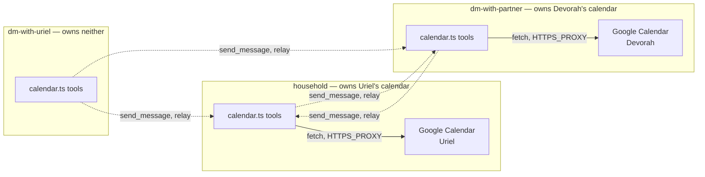

# Architecture Spine — Google Calendar Read/Write

## Design Paradigm

**Single-owner-per-calendar with conversational relay.** Each Google Calendar is connected to exactly one OneCLI agent identity (one Google OAuth grant per identity, verified as the platform's real limit — see AD-2). A calendar MCP tool call is always scoped to "the one calendar this container's identity owns" — it never selects between calendars. Reaching the *other* calendar from a different chat surface is not a tool capability at all; it's an existing conversational primitive (`send_message`, agent-to-agent) carrying a natural-language request to the surface that does own it. The tool layer stays dumb and single-purpose; routing judgment lives in personas, exactly this codebase's existing division of labor between MCP tools and agent behavior.

## Invariants & Rules



### AD-1 — Calendar access via the existing OneCLI Gateway proxy

- **Binds:** CAP-1, CAP-2, CAP-3
- **Prevents:** Inventing new credential plumbing (env vars, a new secret-injection path) when this codebase's established mechanism — the `onecli-gateway` container skill's transparent HTTPS proxy, already listing Google Calendar as a supported app — already covers exactly this.
- **Rule:** Every calendar MCP tool call is a direct `fetch()` to the real Google Calendar REST API v3 URL from inside the container. No credential ever appears in tool code, chat, or an env var the agent can read — the proxy injects it at the network boundary.

### AD-2 — One calendar per OneCLI identity; the tool never selects between calendars [ADOPTED, SDK-verified]

- **Binds:** CAP-1, CAP-2, CAP-3
- **Prevents:** Building multi-account/calendar-selection logic into the tool that the platform doesn't actually support — confirmed by reading `@onecli-sh/sdk@2.2.1`'s type definitions and its real call site in `src/container-runner.ts:627-629`: `applyContainerConfig(args, { agent })` binds a container's *entire* outbound network to one identity (`agentIdentifier = agentGroup.id`) for its whole process lifetime; there is no per-request agent-switching mechanism.
- **Rule:** Every calendar MCP tool call operates on `calendarId=primary` under whichever OneCLI identity the calling container is bound to. No `calendarOwner`/`calendarId` argument exists on the tool schema — "which calendar" is answered entirely by which container the call is running in, never by an argument. (Whether OneCLI's OAuth-connect flow itself is one-grant-per-app-per-agent wasn't independently confirmed beyond the SDK/call-site evidence above — the container-binding rule is what matters here and is fully verified regardless.)

### AD-3 — Calendar ownership assignment and cross-person relay [user-confirmed]

- **Binds:** CAP-1, CAP-2, CAP-3
- **Prevents:** Inventing a new host-mediated multi-identity bridge (a new RPC channel) for one narrow use case, when two already-existing primitives — per-agent-group OneCLI identity (AD-2) and agent-to-agent `send_message` — compose to solve it with zero new host-side plumbing.
- **Rule:** Uriel's Google Calendar connects under household's own OneCLI identity (the family scheduling hub). Devorah's Google Calendar connects under her own `dm-with-partner` identity ("Tina") — her own OAuth grant, never shared or delegated through Uriel's. A chat surface that is not the target calendar's owner (`dm-with-uriel` or `dm-with-partner` asking for Uriel's calendar; `household` or `dm-with-uriel` asking for Devorah's calendar) does not call a calendar tool at all — it calls the existing `send_message` tool, in natural language, to the owning agent's wired destination. The owning agent performs the real calendar action and replies via its own `send_message`.

### AD-4 — Cross-person relay is asynchronous, never same-turn

- **Binds:** CAP-1, CAP-3 (writes; reads relayed the same way inherit this too)
- **Prevents:** Inconsistent latency assumptions across the three personas — one instructed to imply instant completion, another correctly warning the user, producing an inconsistent experience depending on which chat surface handled the request.
- **Rule:** A relayed cross-person calendar action (AD-3) is fire-and-forget over `send_message` — the target agent's container wakes on its own poll cycle, not synchronously within the relaying agent's turn. Every persona touching this sets that expectation up front ("I'll pass this to Devorah's agent, one sec") rather than implying same-turn completion, and the confirmation arrives as a follow-up message from the owning agent.

### AD-5 — Sender identity resolves an unqualified "my calendar" [tightened, reviewer gate]

- **Binds:** CAP-1, CAP-2, CAP-3 — specifically in `household`, the one surface more than one real person shares
- **Prevents:** `household`'s agent silently treating every ambiguous "my calendar"/"my schedule" request as Uriel's, even when Devorah is the one actually asking — and two independently-built stories each inventing a different, possibly-wrong sender→person heuristic, since the only signal at the tool/persona layer is a free-text display name (`sender`/`senderId` in the rendered message tag), not a stable person mapping.
- **Rule:** Sender-to-person resolution reads from the group's own existing OKF memory (e.g. `groups/household/memory/household/people.md`, which already records Uriel's and Devora's names/identifiers) — never a hardcoded name string in tool or skill code. An unmatched or ambiguous sender is asked which calendar they mean, never guessed — same "ask, don't guess" discipline as any other ambiguity in this spine.

### AD-6 — New MCP tools, no new dependency

- **Binds:** CAP-1 (`create_calendar_event`), CAP-2 (`list_calendar_events`), CAP-3 (`update_calendar_event`)
- **Prevents:** A second, inconsistent tool-registration pattern alongside `documents.ts`'s established one; an unnecessary new dependency for a REST surface simple enough for raw `fetch()`.
- **Rule:** `create_calendar_event` / `list_calendar_events` / `update_calendar_event` live in a new `container/agent-runner/src/mcp-tools/calendar.ts`, registered via the existing `McpToolDefinition` + `registerTools()` convention. Each is a direct `fetch()` against Google Calendar REST API v3 (`POST`/`GET`/`PATCH` `https://www.googleapis.com/calendar/v3/calendars/primary/events[/eventId]`, confirmed current — see Stack) through the container's already-injected `HTTPS_PROXY`. No Google API client library. `[ASSUMPTION]` — revisit at build time only if raw-fetch request/response shape safety proves genuinely unwieldy; default is no new dependency.

### AD-7 — Ambiguous event reference: numbered list, never guess [tightened, reviewer gate]

- **Binds:** CAP-2, CAP-3
- **Prevents:** `update_calendar_event`/`list_calendar_events` silently acting on the wrong event when a natural-language reference matches more than one — and, for a cross-person request, silently guessing because the requester's own container has no network path (AD-2) to build or receive a candidate list itself.
- **Rule:** Same disambiguation precedent as `spec-document-memory`'s CAP-2/CAP-3 — when a reference matches more than one real event, present a numbered candidate list and wait for a pick, never guess (e.g. "most recent"). For a **same-owner** request this is unchanged: same-turn, same-container. For a **cross-person** request (AD-3), the *owning* agent builds the candidate list and relays it back (AD-9-marked) via `send_message` to the original requester's destination; the pick flows back the same way — one more relay hop, still async per AD-4.

### AD-8 — Not-connected-yet is the gateway's own contract, not new code

- **Binds:** CAP-1, CAP-2, CAP-3
- **Prevents:** A second, parallel "is this calendar connected" check duplicating what the gateway already reports.
- **Rule:** A `401`/`403`/`app_not_connected` response from the gateway (carrying a `connect_url`) is surfaced back to the agent as-is. The agent already knows how to present that link to the user — the `onecli-gateway` skill's existing instructions cover this; no new connection-status code is written.

### AD-9 — Relay messages are marked request vs. result, never re-relayed

- **Binds:** CAP-1, CAP-3's relay path (AD-3/AD-4)
- **Prevents:** Two AD-3-compliant agents bouncing a confirmation back and forth as if each were a fresh request — `send_message`'s payload is plain, unstructured text with no built-in marker distinguishing "please do X" from "X is done."
- **Rule:** Every relay send carries a fixed, parseable prefix identifying its kind — e.g. `[calendar-relay-request]` vs. `[calendar-relay-result]` — in the `send_message` text. A result-marked message is always terminal: the receiving persona is instructed to never re-relay or re-act on it as a new request.

### AD-10 — Relay requests are field-complete prose, never verbatim-forwarded

- **Binds:** CAP-1, CAP-3's relay path
- **Prevents:** A lossy or ambiguous verbatim-forward of the user's raw phrasing reaching the calendar-owning agent and producing a wrong write — "natural language, not JSON" is satisfied equally by a careful restatement or a lossy paraphrase, and only the former is safe for a write.
- **Rule:** Before relaying a create/update, the relaying agent resolves and restates every field it has — title, start, end, timezone, location, attendees, and who's asking (per AD-5) — as explicit prose in the relay message. It never forwards the user's raw request text unresolved.

### AD-11 — One tool call per named calendar, never a combined call

- **Binds:** CAP-2 primarily; CAP-1/CAP-3 wherever a compound request is possible
- **Prevents:** A single request naming both calendars ("check mine and Devorah's") silently resolving to only the first-named one, since nothing in AD-1–AD-8 says a request can't name more than one target.
- **Rule:** The agent issues one calendar tool call (direct or relayed, per AD-3) per calendar the user actually named — never a single combined-calendar call, and never silently drops the second-named calendar.

### AD-13 — Event `dateTime`/`timeZone` uses the existing timezone convention, never a second one

- **Binds:** CAP-1, CAP-3
- **Prevents:** `create_calendar_event` and `update_calendar_event` diverging on how "Thursday at 3pm" becomes a Google Calendar `dateTime`+`timeZone` pair — this codebase already has a load-bearing convention for exactly this (`resolveGroupTimezone`, `src/container-config.ts`; mirrored host-side in `container/agent-runner/src/timezone.ts`), left silent here would invite one tool to assume UTC and the other to assume local time.
- **Rule:** Every event `dateTime` the tool constructs carries an explicit `timeZone` field resolved via that same existing group-timezone convention. Never a bare/UTC-assumed datetime, never a second, tool-local timezone-resolution path.

### AD-14 — The calendar skill explicitly distinguishes itself from second-brain's OAuth rules

- **Binds:** CAP-1, CAP-2, CAP-3 (the not-connected-yet path, AD-8)
- **Prevents:** A live instance of this repo's own documented shadowing pitfall — `groups/household/instructions.prepend.md` and `groups/dm-with-uriel/instructions.prepend.md` already carry broad "never hand out a connect link, don't imply you're able to" persona language written for second-brain's separate per-tenant OAuth flow. Broad, calendar-adjacent wording sitting in the same files could make an agent apply that older, more specific-sounding rule to the new capability — directly contradicting AD-8's requirement to disclose the gateway's `connect_url`.
- **Rule:** `container/skills/calendar/SKILL.md` names both flows side by side and states plainly they're different: "second-brain OAuth" (never disclose a link, existing rule, unchanged) vs. "OneCLI Google Calendar app connection" (always disclose `connect_url`, per AD-8) — so the agent can't conflate them.

### AD-15 — `NODE_EXTRA_CA_CERTS` shim closes a real TLS-trust gap in AD-6's raw-fetch design [self-found post-finalize, self-resolved]

- **Binds:** CAP-1, CAP-2, CAP-3 — every calendar `fetch()` call
- **Prevents:** Every calendar `fetch()` call failing TLS verification against the gateway's MITM proxy. Verified against real code (`@onecli-sh/sdk@2.2.1`'s `applyContainerConfig`): the gateway's CA cert reaches the container only via `SSL_CERT_FILE`/`DENO_CERT` env vars — never `NODE_EXTRA_CA_CERTS`. Verified against Bun's own docs/issue tracker (web search): Bun's `fetch()` reads `NODE_EXTRA_CA_CERTS` for custom CA trust, not `SSL_CERT_FILE`. This is exactly why this codebase's one existing gateway-proxied precedent, `upload-trace.ts`, uses `curl` (which does honor `SSL_CERT_FILE`) instead of `fetch()` — a gap AD-6 didn't account for when it committed to raw `fetch()`.
- **Rule:** At agent-runner startup, before any calendar tool call can run, set `process.env.NODE_EXTRA_CA_CERTS ??= process.env.SSL_CERT_FILE` when the latter is present — a small, defensive shim, harmless if the gap turns out not to matter in a given environment. This must be verified with one real end-to-end `fetch()` call through the actual running gateway before any calendar story is considered done — not assumed from documentation alone.

## Consistency Conventions

| Concern | Convention |
| --- | --- |
| Naming | `create_calendar_event` / `list_calendar_events` / `update_calendar_event` — verb_calendar_noun, mirroring `save_document` / `list_documents` / `fill_document_field`'s naming shape |
| Error shape | This codebase's existing `err()`/`ok()` MCP content shape (`{ content: [...], isError? }`), same as every other tool in `mcp-tools/` |
| Cross-agent relay text | Natural language via `send_message`, not a structured/JSON payload — `send_message`'s own schema is plain `to`/`text`; no new structured envelope invented for this |

## Stack

| Name | Version |
| --- | --- |
| Google Calendar API | v3 (REST, confirmed current — docs updated 2026-07-07; endpoints `POST`/`GET`/`PATCH` `https://www.googleapis.com/calendar/v3/calendars/{calendarId}/events[/eventId]`) |
| OneCLI Gateway / SDK | `@onecli-sh/sdk@2.2.1` (already pinned in `package.json`, unchanged by this feature) |
| Runtime | Bun's native `fetch()` — confirmed (Bun docs) to honor `HTTP_PROXY`/`HTTPS_PROXY` natively, no new HTTP client dependency. One known caveat (`oven-sh/bun#30381`): raw upstream HTTP/1.1 can leak into `response.body` for `fetch()` through an HTTPS-over-CONNECT proxy in some cases — the gateway is exactly this proxy shape; verify with a real end-to-end call at implementation time (see Deferred). |

## Structural Seed

```text
container/agent-runner/src/mcp-tools/
  calendar.ts            # create_calendar_event, list_calendar_events, update_calendar_event
  calendar.test.ts        # bun:test coverage
container/skills/
  calendar/               # NEW container skill: when/how to use the tools, AD-3's relay rule, AD-5's sender-identity rule
    SKILL.md
```

Setup prerequisite (operational, not code — the build's first task, not a code AD): every pair among `household` / `dm-with-uriel` / `dm-with-partner` needs a bidirectional agent-type destination wired via `ncl destinations add` before AD-3's relay can work. None exist today — `ncl destinations list` currently shows only `channel`-type destinations (each agent's own wired Telegram chat) for all three groups.

## Capability → Architecture Map

| Capability | Lives in | Governed by |
| --- | --- | --- |
| CAP-1 (create) | `calendar.ts`'s `create_calendar_event` | AD-1, AD-2, AD-3, AD-4, AD-5, AD-6, AD-8, AD-9, AD-10, AD-11, AD-13, AD-14, AD-15 |
| CAP-2 (read/query) | `calendar.ts`'s `list_calendar_events` | AD-1, AD-2, AD-3, AD-6, AD-7, AD-8, AD-11, AD-14, AD-15 |
| CAP-3 (update) | `calendar.ts`'s `update_calendar_event` | AD-1, AD-2, AD-3, AD-4, AD-5, AD-6, AD-7, AD-8, AD-9, AD-10, AD-11, AD-13, AD-14, AD-15 |

## Deferred

- No idempotency/duplicate-request guard on `create_calendar_event` — a relayed create and a locally-initiated create hitting the same calendar near-simultaneously from two different chat surfaces could in principle double-book. Not fixed now: a build-time overlap-check-before-insert is a reasonable future hardening, but low real-world likelihood at this system's scale (one household, not a booking platform) doesn't justify the added complexity now.
- Exact `fetch()` request/response typing for the three Calendar API calls — implementation detail, not an invariant; the AD-6 `[ASSUMPTION]` covers whether raw fetch stays sufficient.
- `oven-sh/bun#30381` (HTTPS-over-CONNECT proxy response-body edge case) — verify with one real end-to-end `fetch()` call through the actual OneCLI gateway at implementation time, before trusting the Stack table's AD-6 assumption in production.
- Guest-email resolution when a named guest's address isn't already known (spec's own Open Question) — build-stage detail, not an architecture-level fork.
- Whether `create_calendar_event`/`update_calendar_event` should validate a resolved guest list against `groups/household/memory/household/people.md` automatically, or only when the agent already has it in context — a persona/skill-instruction nuance, not a tool-level invariant.
- The new `container/skills/calendar/` will auto-mount into every group (`selectedSkillNames()` recomputes `'all'` from every skill directory), including groups with no Google Calendar OAuth grant — harmless per AD-8 (a graceful not-connected decline), just an unused-but-present skill for those groups. Not worth scoping per-group now.
- No idempotency/`iCalUID` dedup key on `create_calendar_event` — a retried or duplicated create request could in principle double-book, same class of risk already deferred for the relay path (see `AD-`-adjacent Deferred entry above). Not fixed now.
- Raw network-error messages (a `fetch()` throw's `e.message`) are surfaced verbatim to chat text — a minor infra-detail-leak risk (proxy hostname, internal DNS errors), low priority for a personal single-family system. Not fixed now.
- **`container/agent-runner/src/index.ts`'s `nanoclaw` MCP server spawn used `env: {}` — a pre-existing, previously-unexercised bug found and fixed during Story cal-1.2's review gate**, not by this spine originally: the MCP stdio transport (`@modelcontextprotocol/sdk`, and the same allowlist compiled into the Claude Code CLI binary itself) merges a curated 6-variable safe-list with a server's own `env` config, never full `process.env` inheritance by default. `env: {}` meant the `nanoclaw` MCP server subprocess — where every calendar `fetch()` call actually runs — received none of `HTTPS_PROXY`/`SSL_CERT_FILE`/`NODE_EXTRA_CA_CERTS`, breaking not just AD-15's TLS shim but AD-1's entire gateway-routing premise. Fixed to `env: { ...process.env }` (a first-party, trusted MCP server — full inheritance is correct here, not a security regression). Recorded here rather than as a new AD since it's a bugfix to existing infrastructure, not a new architectural decision — but flagged prominently since it's the most significant single finding in this epic's review process and the spine's own reviewer gate (which stopped at `applyContainerConfig`'s container-level env injection) never traced this deeper, MCP-subprocess-level hop.
- Recurring events, deletion/cancellation, calendars beyond Uriel's/Devorah's — spec non-goals, not deferred to a later architecture pass by name (revisit only if the spec itself is revised).
