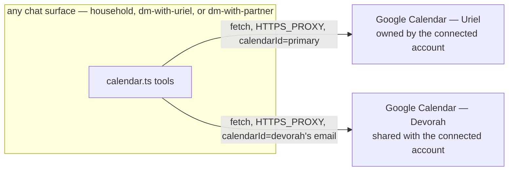

# Architecture Spine — Google Calendar Read/Write

## Design Paradigm

**Single connection, Google-native calendar sharing.** [PIVOT, 2026-08-17 — see AD-2/AD-3] Google Calendar OAuth in OneCLI is one connection per *project*, not per agent identity (live-verified: `onecli apps get --provider google-calendar` returns a global `connection.status`, with no `--agent` scoping anywhere in the CLI surface). One Google account is connected (Uriel's, already done). Its granted `calendar.events` scope covers editing events on **any** calendar that account has access to — not just its own — so Devorah shares her calendar with Uriel's connected account (a one-time action in her own Google Calendar app, no OneCLI/OAuth involvement on her side at all). A calendar MCP tool call takes an explicit `calendar` argument (`uriel` | `devorah`) resolving to a `calendarId` (`primary`, or Devorah's own email) — the tool is a thin, stateless parameter mapping, not a routing decision. Any of the three chat surfaces can call it directly through the one connected identity; no cross-agent relay is needed anywhere in this design.

## Invariants & Rules



### AD-1 — Calendar access via the existing OneCLI Gateway proxy

- **Binds:** CAP-1, CAP-2, CAP-3
- **Prevents:** Inventing new credential plumbing (env vars, a new secret-injection path) when this codebase's established mechanism — the `onecli-gateway` container skill's transparent HTTPS proxy, already listing Google Calendar as a supported app — already covers exactly this.
- **Rule:** Every calendar MCP tool call is a direct `fetch()` to the real Google Calendar REST API v3 URL from inside the container. No credential ever appears in tool code, chat, or an env var the agent can read — the proxy injects it at the network boundary.

### AD-2 — One Google connection; a `calendar` argument selects `calendarId`, never the calling identity [REVISED, 2026-08-17 pivot]

- **Binds:** CAP-1, CAP-2, CAP-3
- **Prevents:** Assuming OneCLI supports one OAuth grant per agent identity — it doesn't. Live-verified: `onecli apps get --provider google-calendar` (run with no agent-scoping, since none exists in the CLI) returns a single, project-wide `connection.status: "connected"`. `applyContainerConfig(args, { agent })`'s per-container network binding (confirmed against `@onecli-sh/sdk@2.2.1` and `src/container-runner.ts:627-629`) is still real, but moot here: every container's `HTTPS_PROXY` reaches the *same* gateway with the *same* single underlying Google account, regardless of which OneCLI identity the container is bound to.
- **Rule:** Every calendar MCP tool call takes an explicit `calendar` argument (`uriel` | `devorah`), resolved to a `calendarId` (`primary` for Uriel's own; Devorah's own email address, `adardevora@gmail.com` per `groups/household/memory/household/people.md`, for hers — reachable because she shares her calendar with the connected account, AD-3). Which container/identity happens to be calling is irrelevant — the argument is what selects the calendar, not the caller.

### AD-3 — Devorah's calendar is reached via Google-native sharing, not a second OAuth connection [REVISED, 2026-08-17 pivot; supersedes the original cross-agent-relay design]

- **Binds:** CAP-1, CAP-2, CAP-3
- **Prevents:** Building a cross-agent relay bridge (the original AD-3/AD-4/AD-9/AD-10/AD-11 design) for a problem Google Calendar's own sharing model already solves at zero engineering cost. The already-granted `calendar.events` OAuth scope (confirmed in the live connection's scope list) covers "edit events on any calendar the connected account has access to" — not scope-limited to the account's own primary calendar.
- **Rule:** Devorah shares her Google Calendar with Uriel's connected account (Google Calendar's own Settings → "Share with specific people" → grant "Make changes to events") — a one-time action she performs herself in her own Google account, no OneCLI dashboard, no second OAuth flow, no agent involvement. Once shared, any chat surface's `calendar.ts` call can target her calendar directly (AD-2's `calendar` argument) through the one already-connected identity. **No cross-agent relay exists anywhere in this design** — AD-4/AD-9/AD-10/AD-11 below are retired, not superseded by a replacement mechanism, because the problem they solved (routing a request to the identity that owns the target calendar) no longer exists.

### AD-4 — [RETIRED, 2026-08-17 pivot] Cross-person relay latency

- **Binds:** (none — retired)
- **Prevents:** N/A. Retired along with the relay design AD-3 originally specified (see AD-3's revision).
- **Rule:** No replacement rule — every calendar call is now synchronous, same-turn, same-container, like any other MCP tool call in this codebase. Id kept, not reused, per this project's memlog convention.

### AD-5 — Sender identity resolves an unqualified "my calendar" [tightened, reviewer gate; repurposed, 2026-08-17 pivot]

- **Binds:** CAP-1, CAP-2, CAP-3 — specifically in `household`, the one surface more than one real person shares
- **Prevents:** `household`'s agent silently treating every ambiguous "my calendar"/"my schedule" request as Uriel's, even when Devorah is the one actually asking — and two independently-built stories each inventing a different, possibly-wrong sender→person heuristic, since the only signal at the tool/persona layer is a free-text display name (`sender`/`senderId` in the rendered message tag), not a stable person mapping.
- **Rule:** Sender-to-person resolution reads from the group's own existing OKF memory (e.g. `groups/household/memory/household/people.md`, which already records Uriel's and Devora's names/identifiers) — never a hardcoded name string in tool or skill code. An unmatched or ambiguous sender is asked which calendar they mean, never guessed. **Post-pivot:** this resolution now picks the `calendar` argument value (AD-2) directly — it no longer picks which agent to relay to, since there is no relay.

### AD-6 — New MCP tools, no new dependency

- **Binds:** CAP-1 (`create_calendar_event`), CAP-2 (`list_calendar_events`), CAP-3 (`update_calendar_event`)
- **Prevents:** A second, inconsistent tool-registration pattern alongside `documents.ts`'s established one; an unnecessary new dependency for a REST surface simple enough for raw `fetch()`.
- **Rule:** `create_calendar_event` / `list_calendar_events` / `update_calendar_event` live in a new `container/agent-runner/src/mcp-tools/calendar.ts`, registered via the existing `McpToolDefinition` + `registerTools()` convention. Each is a direct `fetch()` against Google Calendar REST API v3 (`POST`/`GET`/`PATCH` `https://www.googleapis.com/calendar/v3/calendars/{calendarId}/events[/eventId]`, `calendarId` resolved per AD-2, confirmed current — see Stack) through the container's already-injected `HTTPS_PROXY`. No Google API client library. `[ASSUMPTION]` — revisit at build time only if raw-fetch request/response shape safety proves genuinely unwieldy; default is no new dependency.

### AD-7 — Ambiguous event reference: numbered list, never guess [tightened, reviewer gate; simplified, 2026-08-17 pivot]

- **Binds:** CAP-2, CAP-3
- **Prevents:** `update_calendar_event`/`list_calendar_events` silently acting on the wrong event when a natural-language reference matches more than one.
- **Rule:** Same disambiguation precedent as `spec-document-memory`'s CAP-2/CAP-3 — when a reference matches more than one real event, present a numbered candidate list and wait for a pick, never guess (e.g. "most recent"). **Post-pivot:** always same-turn, same-container — the cross-person relay-and-pick-back variant this AD originally described no longer applies (no relay, AD-3).

### AD-8 — Not-connected-yet is the gateway's own contract, not new code

- **Binds:** CAP-1, CAP-2, CAP-3
- **Prevents:** A second, parallel "is this calendar connected" check duplicating what the gateway already reports.
- **Rule:** A `401`/`403`/`app_not_connected` response from the gateway (carrying a `connect_url`) is surfaced back to the agent as-is. The agent already knows how to present that link to the user — the `onecli-gateway` skill's existing instructions cover this; no new connection-status code is written.

### AD-9 — [RETIRED, 2026-08-17 pivot] Relay request/result marking

- **Binds:** (none — retired)
- **Prevents:** N/A. Retired along with the relay design (AD-3's revision).
- **Rule:** No replacement rule — no relay exists to mark. Id kept, not reused.

### AD-10 — [RETIRED, 2026-08-17 pivot] Field-complete relay composition

- **Binds:** (none — retired)
- **Prevents:** N/A. Retired along with the relay design (AD-3's revision).
- **Rule:** No replacement rule — no relay exists to compose a message for. Id kept, not reused.

### AD-11 — One tool call per named calendar, never a combined call

- **Binds:** CAP-2 primarily; CAP-1/CAP-3 wherever a compound request is possible
- **Prevents:** A single request naming both calendars ("check mine and Devorah's") silently resolving to only the first-named one.
- **Rule:** The agent issues one calendar tool call — same `calendar` argument mechanism (AD-2), just called twice — per calendar the user actually named, never a single combined-calendar call, and never silently drops the second-named calendar.

### AD-13 — Event `dateTime`/`timeZone` uses the existing timezone convention, never a second one

- **Binds:** CAP-1, CAP-3
- **Prevents:** `create_calendar_event` and `update_calendar_event` diverging on how "Thursday at 3pm" becomes a Google Calendar `dateTime`+`timeZone` pair — this codebase already has a load-bearing convention for exactly this (`resolveGroupTimezone`, `src/container-config.ts`; mirrored host-side in `container/agent-runner/src/timezone.ts`), left silent here would invite one tool to assume UTC and the other to assume local time.
- **Rule:** Every event `dateTime` the tool constructs carries an explicit `timeZone` field resolved via that same existing group-timezone convention. Never a bare/UTC-assumed datetime, never a second, tool-local timezone-resolution path.

### AD-14 — The calendar skill explicitly distinguishes itself from second-brain's OAuth rules

- **Binds:** CAP-1, CAP-2, CAP-3 (the not-connected-yet path, AD-8)
- **Prevents:** A live instance of this repo's own documented shadowing pitfall — `groups/household/instructions.prepend.md` and `groups/dm-with-uriel/instructions.prepend.md` already carry broad "never hand out a connect link, don't imply you're able to" persona language written for second-brain's separate per-tenant OAuth flow. Broad, calendar-adjacent wording sitting in the same files could make an agent apply that older, more specific-sounding rule to the new capability — directly contradicting AD-8's requirement to disclose the gateway's `connect_url`.
- **Rule:** `container/skills/calendar/SKILL.md` names both flows side by side and states plainly they're different: "second-brain OAuth" (never disclose a link, existing rule, unchanged) vs. "OneCLI Google Calendar app connection" (always disclose `connect_url`, per AD-8) — so the agent can't conflate them.

### AD-15 — `NODE_EXTRA_CA_CERTS` shim closes a real TLS-trust gap in AD-6's raw-fetch design [self-found post-finalize, self-resolved]

- **Binds:** CAP-1, CAP-2, CAP-3 — every calendar `fetch()` call
- **Prevents:** Every calendar `fetch()` call failing TLS verification against the gateway's MITM proxy. Verified against real code (`@onecli-sh/sdk@2.2.1`'s `applyContainerConfig`): the gateway's CA cert reaches the container only via `SSL_CERT_FILE`/`DENO_CERT` env vars — never `NODE_EXTRA_CA_CERTS`. Verified against Bun's own docs/issue tracker (web search): Bun's `fetch()` reads `NODE_EXTRA_CA_CERTS` for custom CA trust, not `SSL_CERT_FILE`. This is exactly why this codebase's one existing gateway-proxied precedent, `upload-trace.ts`, uses `curl` (which does honor `SSL_CERT_FILE`) instead of `fetch()` — a gap AD-6 didn't account for when it committed to raw `fetch()`.
- **Rule:** At agent-runner startup, before any calendar tool call can run, set `process.env.NODE_EXTRA_CA_CERTS ??= process.env.SSL_CERT_FILE` when the latter is present — a small, defensive shim, harmless if the gap turns out not to matter in a given environment. This must be verified with one real end-to-end `fetch()` call through the actual running gateway before any calendar story is considered done — not assumed from documentation alone.

## Consistency Conventions

| Concern | Convention |
| --- | --- |
| Naming | `create_calendar_event` / `list_calendar_events` / `update_calendar_event` — verb_calendar_noun, mirroring `save_document` / `list_documents` / `fill_document_field`'s naming shape |
| Error shape | This codebase's existing `err()`/`ok()` MCP content shape (`{ content: [...], isError? }`), same as every other tool in `mcp-tools/` |
| Calendar selection | A `calendar` argument (`uriel` \| `devorah`) on every tool call, resolved internally to a `calendarId` (AD-2) — never inferred from which container/identity is calling |

## Stack

| Name | Version |
| --- | --- |
| Google Calendar API | v3 (REST, confirmed current — docs updated 2026-07-07; endpoints `POST`/`GET`/`PATCH` `https://www.googleapis.com/calendar/v3/calendars/{calendarId}/events[/eventId]`) |
| OneCLI Gateway / SDK | `@onecli-sh/sdk@2.2.1` (already pinned in `package.json`, unchanged by this feature) |
| Runtime | Bun's native `fetch()` — confirmed (Bun docs) to honor `HTTP_PROXY`/`HTTPS_PROXY` natively, no new HTTP client dependency. One known caveat (`oven-sh/bun#30381`): raw upstream HTTP/1.1 can leak into `response.body` for `fetch()` through an HTTPS-over-CONNECT proxy in some cases — the gateway is exactly this proxy shape; verify with a real end-to-end call at implementation time (see Deferred). |

## Structural Seed

```text
container/agent-runner/src/mcp-tools/
  calendar.ts            # create_calendar_event, list_calendar_events, update_calendar_event
  calendar.test.ts        # bun:test coverage
container/skills/
  calendar/               # NEW container skill: when/how to use the tools, the `calendar` argument, AD-5's sender-identity rule
    SKILL.md
```

Operational prerequisite (not code, and — post-pivot — not blocking): Devorah shares her Google Calendar with the connected account (AD-3) before her calendar is reachable. The 6 cross-agent `agent`-type destinations wired for the original relay design (`household`/`dm-with-uriel`/`dm-with-partner`, via `ncl destinations add`) are harmless leftover infrastructure — `send_message` remains generally useful for unrelated purposes — but are no longer required for calendar access specifically.

## Capability → Architecture Map

| Capability | Lives in | Governed by |
| --- | --- | --- |
| CAP-1 (create) | `calendar.ts`'s `create_calendar_event` | AD-1, AD-2, AD-3, AD-5, AD-6, AD-8, AD-11, AD-13, AD-14, AD-15 |
| CAP-2 (read/query) | `calendar.ts`'s `list_calendar_events` | AD-1, AD-2, AD-3, AD-6, AD-7, AD-8, AD-11, AD-14, AD-15 |
| CAP-3 (update) | `calendar.ts`'s `update_calendar_event` | AD-1, AD-2, AD-3, AD-5, AD-6, AD-7, AD-8, AD-11, AD-13, AD-14, AD-15 |

## Deferred

- No idempotency/duplicate-request guard on `create_calendar_event` — two near-simultaneous create calls from two different chat surfaces (household, dm-with-uriel, dm-with-partner) could in principle double-book the same calendar. Not fixed now: a build-time overlap-check-before-insert is a reasonable future hardening, but low real-world likelihood at this system's scale (one household, not a booking platform) doesn't justify the added complexity now.
- Exact `fetch()` request/response typing for the three Calendar API calls — implementation detail, not an invariant; the AD-6 `[ASSUMPTION]` covers whether raw fetch stays sufficient.
- `oven-sh/bun#30381` (HTTPS-over-CONNECT proxy response-body edge case) — verify with one real end-to-end `fetch()` call through the actual OneCLI gateway at implementation time, before trusting the Stack table's AD-6 assumption in production.
- Guest-email resolution when a named guest's address isn't already known (spec's own Open Question) — build-stage detail, not an architecture-level fork.
- Whether `create_calendar_event`/`update_calendar_event` should validate a resolved guest list against `groups/household/memory/household/people.md` automatically, or only when the agent already has it in context — a persona/skill-instruction nuance, not a tool-level invariant.
- The new `container/skills/calendar/` will auto-mount into every group (`selectedSkillNames()` recomputes `'all'` from every skill directory), including groups with no Google Calendar OAuth grant — harmless per AD-8 (a graceful not-connected decline), just an unused-but-present skill for those groups. Not worth scoping per-group now.
- No idempotency/`iCalUID` dedup key on `create_calendar_event` — a retried or duplicated create request could in principle double-book, same class of risk already deferred for the relay path (see `AD-`-adjacent Deferred entry above). Not fixed now.
- Raw network-error messages (a `fetch()` throw's `e.message`) are surfaced verbatim to chat text — a minor infra-detail-leak risk (proxy hostname, internal DNS errors), low priority for a personal single-family system. Not fixed now.
- **`container/agent-runner/src/index.ts`'s `nanoclaw` MCP server spawn used `env: {}` — a pre-existing, previously-unexercised bug found and fixed during Story cal-1.2's review gate**, not by this spine originally: the MCP stdio transport (`@modelcontextprotocol/sdk`, and the same allowlist compiled into the Claude Code CLI binary itself) merges a curated 6-variable safe-list with a server's own `env` config, never full `process.env` inheritance by default. `env: {}` meant the `nanoclaw` MCP server subprocess — where every calendar `fetch()` call actually runs — received none of `HTTPS_PROXY`/`SSL_CERT_FILE`/`NODE_EXTRA_CA_CERTS`, breaking not just AD-15's TLS shim but AD-1's entire gateway-routing premise. Fixed to `env: { ...process.env }` (a first-party, trusted MCP server — full inheritance is correct here, not a security regression). Recorded here rather than as a new AD since it's a bugfix to existing infrastructure, not a new architectural decision — but flagged prominently since it's the most significant single finding in this epic's review process and the spine's own reviewer gate (which stopped at `applyContainerConfig`'s container-level env injection) never traced this deeper, MCP-subprocess-level hop.
- Recurring events, calendars beyond Uriel's/Devorah's — spec non-goals, not deferred to a later architecture pass by name (revisit only if the spec itself is revised).
- **Deletion/cancellation — built, 2026-08-18** (bounded change, no new architecture-spine revision): `delete_calendar_event`, same `calendar.ts` file, same `CALENDAR_IDS`/`searchEvents`/AD-8 plumbing as the other three tools. **Revised same day, live incident:** the first version gated deletion behind a `confirm: boolean` argument, trusting the agent to always call `ask_user_question` itself before setting it — AD-7's disambiguation trust model. A real production request ("תמחק את בדיקת יומן") showed that trust doesn't hold: the agent treated the delete instruction itself as sufficient confirmation and deleted the event with zero question ever shown to the user (confirmed via the session's `outbound.db` — one inbound message, one outbound "deleted" reply, no `ask_question` card in between). Fixed by moving the confirmation inside the tool itself — `delete_calendar_event`'s handler calls `askUserQuestion.handler(...)` directly (in-process, not a second MCP round trip) once exactly one event is resolved, and only issues the real `DELETE` if the user answers yes. One tool call, structurally blocking — nothing left for the agent to skip or self-authorize. The `confirm` argument no longer exists.
