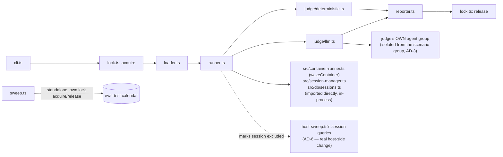
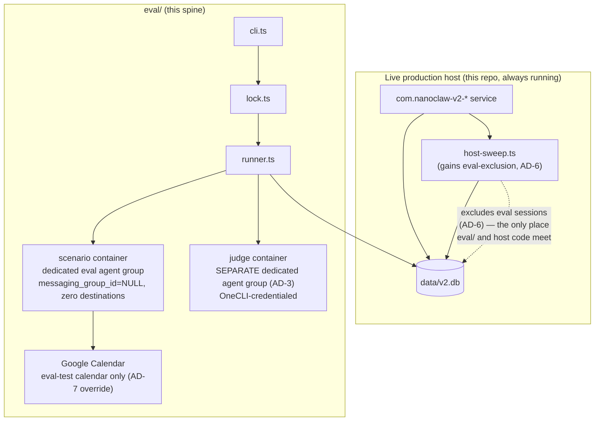

# Architecture Spine — Agent Evaluation Harness

> This spine went through a real reviewer gate (rubric + version-verification + adversarial-incompatibility, 3 parallel subagents) before being finalized. The first draft's delivery-safety and calendar-isolation guarantees were both structurally broken; the current AD set is what survived that pass. The three review files are companions — read them for the full attack trace if an AD's Rule looks stricter than seems necessary, it's there because a specific exploit was found.

## Design Paradigm

**Orchestrated pipeline.** Four stages, each a distinct module, each depending only on the stage before it (never sideways, never forward): `loader → runner → judge → reporter`. A CLI entry point drives the pipeline; nothing else calls `runner`/`judge`/`reporter` directly.

```text
eval/
  cli.ts          # entry point — `pnpm eval run <set>` / `pnpm eval sweep`, drives the pipeline
  setup.ts        # one-time: creates the dedicated eval agent group + judge agent group,
                   # registers the eval-test calendar with the uriel-override trick (AD-7),
                   # read-only mounts household's people.md (AD-7) for guest-resolution scenarios
  loader.ts       # reads a scenario set file, validates against the schema (scenario-format.md)
  runner.ts       # loader's output in → real container spawn + message + outbound capture out (CAP-1)
  judge/
    deterministic.ts  # exact-assertion checks (CAP-2)
    llm.ts             # spawns the judge container under its OWN agent group, calls it, parses verdict+reasoning (CAP-3)
  reporter.ts     # writes JSON report + prints console summary (CAP-6)
  sweep.ts        # standalone stale-event sweep (CAP-7) — not part of the run pipeline, its own entry
  lock.ts         # run-exclusivity (AD-8) — reused mtime-stale-lock pattern
  scenarios/
    guest-resolution.scenarios.ts   # the v1 scenario set
```

## Invariants & Rules



### AD-1 — Eval session identity: no origin chat, no destinations, own agent group

- **Binds:** CAP-1, CAP-4
- **Prevents:** An eval scenario's own `<message to="X">` reply reaching a live Telegram/WhatsApp/etc chat. First draft of this AD said "zero destinations" alone was the guarantee — adversarial review found that's false: `delivery.ts`'s origin-chat reply path delivers unconditionally whenever `session.messaging_group_id` matches the message's target, with **no** consultation of the `agent_destinations` table at all (that's how every normal conversation reply already works, by design — destinations are for *cross-group* routing only). Zero destinations closes the cross-group path; it does nothing about the origin-chat path.
- **Rule:** Every scenario run's session has **`messaging_group_id: NULL`** — there is no origin chat for the origin-chat path to match into — and its `thread_id` follows this codebase's existing `system:`-prefixed-thread convention (already used for scheduled tasks, `isTaskThread()` in `src/db/sessions.ts`). The session's `agent_group_id` is one dedicated agent group (created by `setup.ts`) used for eval scenario runs only, with **zero** entries in `destinations` as a second, independent layer (AD-4 still verifies this at run time — a `NULL` origin plus zero destinations means both delivery paths are closed, not just one).

### AD-2 — In-process host module reuse, not a reimplementation

- **Binds:** CAP-1
- **Prevents:** A parallel, hand-rolled spawn/message/poll implementation drifting from real production behavior over time — exactly the class of bug this project's own history shows unit tests miss (the MCP-subprocess config gap, the per-group memory isolation gap, the mount-allowlist rejection all lived in this exact layer).
- **Rule:** `runner.ts` calls `wakeContainer` (`src/container-runner.ts`), `writeSessionMessage`/`openOutboundDb` (`src/session-manager.ts`), and `createSession` (`src/db/sessions.ts`) directly, in-process, against the live `data/v2.db` — the same functions and the same database the real host process uses. No network boundary, no reimplementation, no mocked spawn path. **This shares the database, not the running host process's in-memory state** — see AD-6, the gap that fact creates.

### AD-3 — Judge runs under its own agent group, credentials never touch the host process

- **Binds:** CAP-3
- **Prevents:** Two separate risks. (1) A new, unprecedented credential-access surface on the host process — this codebase has deliberately never given the host direct Claude API access; only containers call Claude, and only via OneCLI-injected credentials (`onecli-gateway` skill, `ensureAgent` in `container-runner.ts`). (2) *(adversarial finding)* AD-1's isolation only literally covered "the scenario run's container" — the judge's own separate spawn was an ungoverned second path to a real chat send, and a judge bug could touch the scenario's own session/group state if they shared one.
- **Rule:** `judge/llm.ts` never holds or requests a raw Anthropic API key. A judge call spawns its own lightweight container under a **second, separate dedicated agent group** (also `setup.ts`-created, also `messaging_group_id: NULL` + zero destinations, per AD-1's full rule) — not the scenario group — and reads its verdict back through that container's own outbound channel, the same way `runner.ts` reads a scenario's outcome.

### AD-4 — Destination-emptiness is checked, not assumed

- **Binds:** CAP-1, AD-1
- **Prevents:** AD-1's guarantee silently rotting — someone (a human, a future self-mod action, a copy-pasted `ncl destinations add`) adds a real destination to an eval agent group months from now, and every run after that point can leak to a live chat with no one noticing.
- **Rule:** `runner.ts` (and `judge/llm.ts` for its own group) checks the destination list for its agent group as its very first step, before spawning anything, and refuses to run — loud failure, not a silent skip — if the destination list is non-empty, or if the session's own `messaging_group_id` is not `NULL`.

### AD-5 — Judging is domain-agnostic; scenario content is not

- **Binds:** CAP-5
- **Prevents:** A second scenario domain (e.g. sender-identity resolution, `SPEC.md`'s own generalization target) requiring changes to `runner.ts`, `judge/*.ts`, or `reporter.ts` to add.
- **Rule:** `loader.ts`, `runner.ts`, `judge/*.ts`, and `reporter.ts` never reference calendar-specific (or any domain-specific) concepts by name. Everything domain-specific — scenario messages, assertion logic, rubric text — lives only in `scenarios/*.scenarios.ts` files, conforming to the schema in `scenario-format.md`. Adding a domain means adding a file under `scenarios/`, nothing else.

### AD-6 — Eval sessions are excluded from the live host's own sweep

- **Binds:** CAP-1
- **Prevents:** *(rubric finding, critical)* `host-sweep.ts` (part of the always-running host service — this repo is the live production install, the service is never stopped for an eval run, see the Constraints entry below) sweeps every active session globally every 60s. `isContainerRunning`/`activeContainers` (`src/container-runner.ts`) is **process-local, in-memory** — the eval CLI is a separate OS process from the host service, so the host's own sweep sees an eval-spawned container as "not running" (it has no in-memory record of it) and will duplicate-spawn it, corrupting the scenario's in-flight `processing_ack` claim and any transcript capture for a turn that takes over 60s. This is a real, load-bearing gap in the *existing host code*, not something `eval/` can close on its own from outside.
- **Rule:** Every session `runner.ts`/`judge/llm.ts` creates gets a DB-level marker (e.g. a `managed_by = 'eval'` value on the session row, or an equivalent existing extensible column — the exact column is an implementation decision for whoever builds this, not fixed here) that `host-sweep.ts`'s global session queries (and any other code path built on `getRunningSessions()`/`getActiveSessions()` in `src/db/sessions.ts`) explicitly exclude. **This requires a real, small change to `host-sweep.ts` itself** — `eval/` is not purely additive; it has exactly one dependency edge back into existing host code, and that edge is this one, nowhere else.

### AD-7 — Calendar isolation reuses the existing name-override mechanism, not new code

- **Binds:** CAP-4
- **Prevents:** *(rubric finding, critical)* `resolveCalendarIds()` (`calendar.ts`) always merges the built-in `CALENDAR_IDS` (`uriel` → `'primary'`, the real household calendar) with a group's own registry — every agent group can resolve `"uriel"`, including the eval group, with nothing in the harness itself stopping an ambiguous scenario message from writing a real event to Uriel's actual calendar.
- **Rule:** `setup.ts` registers the eval agent group's `calendar_registry` with an override entry `{ name: "uriel", calendarId: <eval-test-calendar-id> }` — reusing `calendar.ts`'s own existing "a registry entry wins over a built-in name on collision" behavior (Story 2.3 / AD-18, already implemented and tested) rather than adding any new calendar-isolation code. Any other built-in or registry name a future scenario domain references gets the same override treatment. No scenario, present or future, resolves a real calendar name for the eval group.
- **Same reuse-not-invent principle, one more mount:** the guest-resolution scenario set needs the real `household` group's `people.md` to have anything meaningful to resolve against (SPEC.md's own Assumption) — a brand-new dedicated eval group has no memory of its own. `setup.ts` read-only-mounts it in, reusing the exact `ncl groups config add-mount` + `mount-security` allowlist mechanism already live for Yulanda/Tina (not new code, same pattern this AD already establishes for calendars).

### AD-8 — Run-exclusivity via the existing stale-lock pattern

- **Binds:** CAP-1, CAP-7
- **Prevents:** *(adversarial finding, high)* Two concurrent invocations — two scenario runs, or a run overlapping the standalone sweep — race on the same eval agent group's shared RW-mounted `groupDir` (memory, `CLAUDE.md`; `container-runner.ts` mounts this once per group, shared by every session under it).
- **Rule:** `lock.ts` reuses the mtime-based stale-lock pattern already implemented in `container/agent-runner/src/mcp-tools/documents.ts` (`withLock()`, `LOCK_STALE_MS`) — a lock file under the eval group's workspace, acquired by `cli.ts` (for a run) or `sweep.ts` (for a sweep) before anything else happens, released on exit, treated as abandoned and reclaimed after the same staleness window if a prior run crashed without releasing it. A second concurrent invocation that can't acquire the lock fails loud with a clear message; it never proceeds to race.

## Consistency Conventions

| Concern | Convention |
| --- | --- |
| Naming | Scenario ids: `<domain>-<case>` (e.g. `guest-resolution-known-name`), matching `scenario-format.md`'s worked examples. Scenario-set files: `<domain>.scenarios.ts`. |
| Data & formats | Reports: `eval/reports/<run-id>/report.json`, `run-id` = ISO-8601 timestamp with `:` stripped (filesystem-safe), matching this project's own timestamp convention (`new Date().toISOString()`, never `datetime('now')`). |
| State & cross-cutting | Every DB write goes through the existing host modules (AD-2) — `eval/` never opens its own raw `better-sqlite3` handle against `data/v2.db`'s `container_configs`/`agent_groups`/`sessions` tables; it reads/writes only through the functions those tables already have. Eval sessions use `system:`-prefixed thread ids (AD-1), matching the scheduled-task convention rather than inventing a new one. |

## Stack

| Name | Version |
| --- | --- |
| TypeScript / Node (host) | Same as `nanoclaw` host package — no new runtime introduced |
| better-sqlite3 | 11.10.0 (pinned, matches host `package.json` — version-verification lens confirmed exact match) |
| tsx (script execution) | ^4.19.0 (matches host `package.json`, same convention as `scripts/q.ts` — confirmed exact match) |

No new dependency is introduced by this spine — `eval/` is assembled entirely from the host's existing toolchain and its existing exported functions (AD-2). The one non-additive piece is the small `host-sweep.ts` exclusion (AD-6).

## Structural Seed

```text
eval/
  cli.ts
  setup.ts
  loader.ts
  runner.ts
  judge/
    deterministic.ts
    llm.ts
  reporter.ts
  sweep.ts
  lock.ts
  scenarios/
    guest-resolution.scenarios.ts
  reports/
    <run-id>/
      report.json

src/host-sweep.ts   # existing file — gains the eval-session exclusion (AD-6), the ONE edge back into host code
```



### Deployment & operational envelope

*(rubric finding, medium — stated explicitly rather than left silent)* Eval runs happen **while the live host service keeps running** — this repo is the production install; the service is never stopped for a test run. Every AD above is written under that assumption. There is no separate "eval environment" — `eval/` is a client of the same live `data/v2.db` and the same live containers infrastructure, isolated by session/agent-group identity (AD-1, AD-3) and process coordination (AD-6, AD-8), not by a separate deployment.

## Capability → Architecture Map

| Capability | Lives in | Governed by |
| --- | --- | --- |
| CAP-1 (run scenario, real container) | `runner.ts` | AD-1, AD-2, AD-4, AD-6, AD-8 |
| CAP-2 (deterministic checks) | `judge/deterministic.ts` | AD-5 |
| CAP-3 (LLM judge) | `judge/llm.ts` | AD-3, AD-5 |
| CAP-4 (isolated test calendar) | `setup.ts` (registry override), `scenarios/*.scenarios.ts` cleanup fields | AD-7, AD-1 (delivery isolation) |
| CAP-5 (domain-agnostic interface) | `loader.ts`, `runner.ts`, `judge/*.ts`, `reporter.ts` | AD-5 |
| CAP-6 (CLI, on-demand) | `cli.ts`, `reporter.ts` | Consistency Conventions (report format) |
| CAP-7 (stale-event sweep) | `sweep.ts` | AD-7 (same eval-test calendar), AD-8 (own lock) |

## Deferred

- **CI integration and scheduled runs** — SPEC.md's own Non-goals rule this out for v1; if it's ever picked up, AD-4's destination-emptiness check becomes even more load-bearing (a scheduled job removes the human-in-the-loop who'd otherwise notice a misconfigured destination before running), and AD-6's host-sweep exclusion needs re-verifying against whatever the CI runner's process model turns out to be (likely still a separate process from the live host — same gap, same fix, just worth re-checking, not re-deciding).
- **A generic multi-domain scenario taxonomy beyond the interface AD-5 already fixes** — SPEC.md's Non-goals: only one scenario domain (`guest-resolution`) ships now; the *interface* is generic, the *catalog of domains* is not built out yet.
- **Multi-turn / conversation-drift scenarios** — SPEC.md's Non-goals: v1 scenarios are single-exchange only; a future multi-turn scenario shape (if ever needed) would need its own `judging`/`setup` field additions to `scenario-format.md`, not decided here.
- **Whether the eval-test calendar needs per-group separation later** — SPEC.md resolved this as "one shared calendar" for v1; AD-7's override trick works identically whether it's one calendar or several, so this remains a scenario-format/setup.ts choice, not an architectural one.
- **Report retention/cleanup policy for `eval/reports/`** — not addressed; left for whoever notices the directory growing unbounded.
- **The exact DB column/mechanism for AD-6's `managed_by`-style exclusion marker** — the *requirement* (host-sweep must skip eval sessions) is fixed; the concrete column name/migration is implementation detail for the build step.
