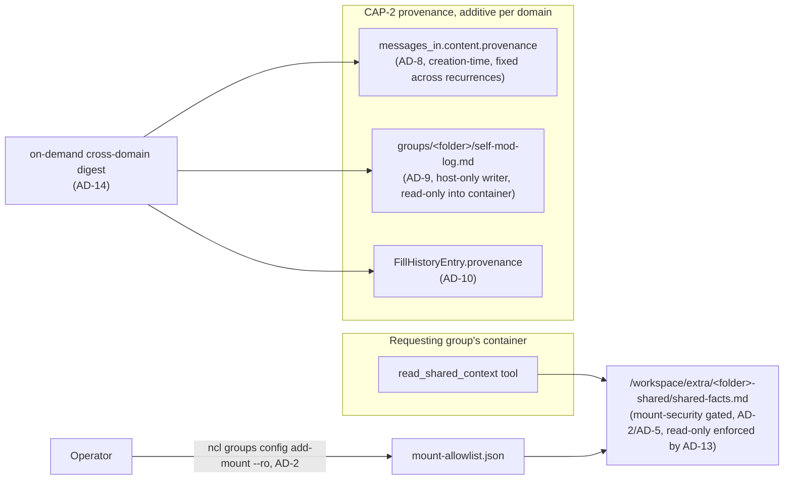

> **Canonical contract.** This spine and its companions are the complete, preservation-validated contract for what to build. `[ASSUMPTION]` tags are fast-path calls for the user to confirm or correct in review.

# Architecture Spine — Cross-Group Context Sharing + Provenance/Receipts

## Design Paradigm

No new paradigm. Both capabilities compose onto NanoClaw's existing shape: a host Node process and per-agent-group Docker containers communicating only through mounted SQLite session DBs and mounted filesystem trees; inside a container, capabilities are exposed to the agent as MCP tools, and admin-only configuration goes through `ncl`. CAP-1 adds one new MCP tool reading from an existing mount-security-gated mount point; CAP-2 adds additive provenance fields to three existing per-domain records plus one new per-group log file that mirrors an already-established pattern (`run-log.ts`). No new runtime, no new IPC channel, no new database table.



## Invariants & Rules

### AD-1 — No new communication path

- **Binds:** CAP-1, CAP-2
- **Prevents:** a second, incompatible way for a container to reach another group's data, or for provenance to be recorded, alongside the existing host↔container DB/filesystem mount surface
- **Rule:** `[ADOPTED]` CAP-1 reads only through a filesystem mount already validated by `src/modules/mount-security`; CAP-2 writes only into existing per-session/per-group storage (`messages_in.content`, `groups/<folder>/*.md`, `FillHistoryEntry`). No new IPC channel, no new host↔container protocol.

### AD-2 — CAP-1's grant reuses the existing mount mechanism, always read-only

- **Binds:** CAP-1
- **Prevents:** inventing a second, parallel cross-group trust boundary alongside the mount-allowlist that already exists and is already proven in production (household's `people.md` mounted read-only into other groups); a shared-context grant silently landing read-write because `--ro` was forgotten (mount-security defaults to read-write unless `--ro` is explicitly passed)
- **Rule:** A cross-group sharing grant is `ncl groups config add-mount --ro`, unchanged mechanism, `hostOnly: true`, `access: 'approval'`, operator-configured, requiring `ncl groups restart` to take effect. `--ro` is mandatory for a shared-context grant — enforced in code, not just documentation, by AD-13. CAP-1 adds no self-service or agent-initiated dynamic grant.

### AD-3 — Shareable facts live in one fixed, dedicated, lock-guarded file, scoped to durable facts

- **Binds:** CAP-1
- **Prevents:** one operator mounting an entire memory tree and another mounting a single curated file (a generic query tool cannot be written against an undefined shape); a concurrent write racing an in-progress read; scope creep into full conversational memory or content calendar/documents already own
- **Rule:** A source group's shareable facts live at `memory/shared-facts.md`, kebab-case, using the existing OKF frontmatter convention (`docs/memory.md`). This is the only file CAP-1 ever reads or expects to be mounted. Content is scoped to durable household facts (birthdays, sizes, preferences, and similarly stable data) — never a dump of conversational memory, calendar, or document content, which already have their own recall paths. Every write to it goes through the same `withLock`/atomic-write discipline the sibling document-memory spine's AD-11 already established for shared per-group files.

### AD-4 — One new MCP tool, following the existing registration convention

- **Binds:** CAP-1
- **Prevents:** a bespoke, one-off way of exposing this to the agent instead of the established tool surface
- **Rule:** `[ADOPTED]` `read_shared_context` is a new `McpToolDefinition` in `container/agent-runner/src/mcp-tools/shared-context.ts`, registered via `registerTools([...])` (mirrors `calendar.ts`), wired in via one `import` line in `mcp-tools/index.ts`, with a sibling `*.instructions.md`. This is an agent-runtime read, not an admin action — resolves SPEC.md's open question on MCP tool vs. CLI verb in favor of the tool.

### AD-5 — containerPath convention matches the codebase's own existing precedent

- **Binds:** CAP-1
- **Prevents:** `read_shared_context` having to scan an arbitrary, operator-chosen mount tree, and contradicting the one precedent this exact pattern already has in this codebase
- **Rule:** `[ADOPTED]` When an operator runs `add-mount` to share one group's `shared-facts.md` with another, `--container-path` must be `<source-group-folder>-shared/shared-facts.md` — filename included, matching `eval/setup.ts`'s existing `household-shared/people.md` precedent exactly, not a bare directory. `read_shared_context` constructs `/workspace/extra/<source-group-folder>-shared/shared-facts.md` deterministically from the known folder name.

### AD-6 — No grant is a clean result, never an error or a silent guess

- **Binds:** CAP-1
- **Prevents:** one implementation throwing on a missing mount and another silently returning empty — both read wrong to the agent and, downstream, to the user
- **Rule:** `read_shared_context` returns one identical, explicit "not shared with you" result whether no grant exists, a grant exists but the file hasn't been written yet, or mount-security rejected the mount — the agent doesn't need to distinguish these. The operator-facing diagnostic for the rejected case is the existing mount-security `WARN` log (`nanoclaw.error.log`), the same already-established path this project's own troubleshooting order already prescribes for any rejected mount — no new diagnostic mechanism.

### AD-7 — One provenance shape, reused across every domain

- **Binds:** CAP-2
- **Prevents:** tasks, self-mod, and document writes each inventing an incompatible ad hoc "why" shape; a redundant field duplicating data a domain already has
- **Rule:** `{ triggeredBy: 'user' | 'agent' | 'system'; requesterUserId?: string; message?: string; reason?: string; at: string /* ISO-8601 UTC */ }` is the one provenance shape CAP-2 ever writes. `requesterUserId` is resolved from session/user context when available; it does not duplicate a domain's own pre-existing session-identifying field (see AD-8).

### AD-8 — Task provenance is additive on the existing content JSON, fixed at series creation

- **Binds:** CAP-2
- **Prevents:** a new tasks-adjacent table or column when the existing storage already accepts arbitrary JSON; a redundant session field duplicating the pre-existing `originSessionId`; `content.provenance` silently going stale on every recurrence fire after the first (`insertRecurrence` copies `content` verbatim) being mistaken for a bug rather than a defined scope
- **Rule:** `ncl tasks create` captures AD-7's shape into `content.provenance` on the `messages_in` row (`kind='task'`), alongside the pre-existing `prompt`/`script`/`originSessionId` fields — `originSessionId` remains the task's session-identifying field; `provenance.requesterUserId` is additive, not a replacement. `content.provenance` is defined as the series' **original creation** provenance — why the series exists — and is, by design, unchanged across every recurrence fire; it is never backfilled onto tasks created before this ships. "What happened on this specific firing" is answered separately, by the pre-existing `run-log.ts`/`task_log` entry for that run — a why-query for one firing combines both, never expects `content.provenance` alone to answer it.

### AD-9 — Self-mod provenance is a new, capped, read-only-mounted per-group log

- **Binds:** CAP-2
- **Prevents:** widening the blast radius of the shared `pending_approvals` table (used by every approval-gated action in the system, not just self-mod) to retain rows it currently deletes on resolve; the agent tampering with its own audit trail; unbounded file growth; provenance being mistaken for covering self-mod changes made before this ships
- **Rule:** Every self-mod apply handler (`applyAddCalendar` and siblings), running host-side in `src/modules/self-mod/apply.ts`, appends one line to `groups/<folder>/self-mod-log.md` — in the same file-per-group markdown-log style `run-log.ts` already established for tasks, capped at a fixed entry count (`SELF_MOD_LOG_CAP`, same role as `FillHistoryEntry`'s `FILL_HISTORY_CAP`) rather than growing unbounded, guarded by the same `withLock`/atomic-write discipline as AD-3. The file is mounted **read-only** into its own group's container — the same convention `container-runner.ts` already applies to `CLAUDE.md`/`container.json` — since the host-side apply handler is its sole legitimate writer; the container has no writer for it. `pending_approvals` itself is left unchanged — still deleted on resolve for every action type, self-mod included. **Deviation from SPEC.md's literal wording** ("reuse existing structures... self-mod approval log"): this reuses the existing *pattern* (`run-log.ts`'s file-per-group log), not the literal named structure (`pending_approvals`), for the blast-radius reason above — a conscious, narrow departure, surfaced here for sign-off rather than silently applied. No backfill for changes applied before this ships.

### AD-10 — Document provenance is an additive optional field on the existing history entry

- **Binds:** CAP-2
- **Prevents:** a parallel provenance store diverging from the version history `list_document_versions` already reads; provenance being mistaken for covering writes made before this ships
- **Rule:** `FillHistoryEntry` gains one additive optional field, `provenance` (AD-7's shape), captured at write time by `fillOneDocument` and the `save_document` refresh path. Entries without it remain valid, per `readFillHistory`'s existing tolerant-reader/backward-compat handling (already normalizes pre-`kind` entries the same way). No backfill for fills made before this ships.

### AD-11 — On-demand retrieval per domain ships now; a periodic push digest is deferred

- **Binds:** CAP-2
- **Prevents:** building push/digest infrastructure the source intent doc never committed to as a hard requirement, ahead of confirming the on-demand shape is actually sufficient
- **Rule:** `list_document_versions` renders `provenance` when present; a task's provenance is visible via the existing `ncl tasks get` output; self-mod's is answerable by reading `self-mod-log.md` (AD-9) — and all three are federated by AD-14's on-demand digest. Only a *periodic, proactively-pushed* digest is out of scope for this spec (see Deferred).

### AD-12 — CAP-1's persona-level claim is verified the same way every other one in this repo is

- **Binds:** CAP-1
- **Prevents:** shipping an unfalsifiable behavioral claim (this repo's own deferred-work.md already flagged that class of gap once, for guest resolution)
- **Rule:** `eval/scenarios/shared-context.scenarios.ts` follows the existing `ScenarioSetFactory` convention (`guest-resolution.scenarios.ts` as precedent), registered in `loader.ts`'s `SCENARIO_SETS`: one deterministic case (an exact fact match when a grant exists) and one `llmJudge` case (the agent declines/asks rather than guessing when no grant exists).

### AD-13 — A shared-context mount is rejected server-side if it isn't read-only

- **Binds:** CAP-1
- **Prevents:** AD-2's `--ro` requirement being only a documentation convention an operator can still get wrong, silently granting write access into a source group's shared facts
- **Rule:** `config add-mount`'s existing handler (`src/cli/resources/groups.ts`) gains one guard clause: a `--container-path` matching the `*-shared/` convention (AD-5) is rejected outright unless `--ro` is also passed. Small, scoped, no new subsystem — a belt-and-suspenders check specific to this naming convention, not a general mount-security redesign.

### AD-14 — An on-demand digest federates all three provenance surfaces

- **Binds:** CAP-2
- **Prevents:** SPEC.md's Assumption ("the digest is in scope as part of answerable-on-demand") being silently dropped along with the periodic-push mechanism it's often paired with in the source brainstorm — those are two different things, and only the push half is actually out of scope
- **Rule:** A new query surface (`ncl tasks` extension, an MCP tool, or CLI verb — implementation choice deferred to the epic/story that builds it) answers "what have you automated recently and why" by reading across AD-8's task provenance, AD-9's `self-mod-log.md`, and AD-10's document `FillHistoryEntry.provenance`, pulled on demand — never proactively pushed (AD-11).

## Consistency Conventions

| Concern | Convention |
| --- | --- |
| Naming (tools, files) | MCP tool: `read_shared_context`, `snake_case` verb-first, matching `save_document`/`list_documents`. Shared-facts file: `shared-facts.md`, fixed name (AD-3). Self-mod log: `self-mod-log.md`, fixed name (AD-9). Mount containerPath: `<folder>-shared/<filename>` (AD-5). |
| Data & formats (provenance) | One shape everywhere (AD-7): `triggeredBy`/`requesterUserId?`/`message?`/`reason?`/`at` (ISO-8601 UTC, per this project's timestamp rule). |
| State & cross-cutting (mounts, grants) | All cross-group access stays read-only (AD-2, enforced by AD-13) and one-directional per grant (SPEC.md constraint); no capability introduced here ever writes into another group's memory. |
| Testing (per project-context.md's rigor bar) | Both host (`pnpm test`) and container (`bun test`) trees get real coverage for every AD in this spine — not scoped down to household-minimal, matching every other epic in this codebase. CAP-1's persona-level claim additionally gets eval-harness coverage (AD-12); host-side changes (AD-8, AD-13) additionally get `tsc --noEmit` on the host tsconfig, container-side changes (AD-4, AD-9's write path) on the container tsconfig. |

## Stack

No new runtime dependencies for either capability — CAP-1 and CAP-2 are pure composition on existing libraries/tables/conventions (`bun:sqlite`, the existing MCP-tool SDK, existing mount-security/approvals modules already in the dependency tree). Verified during the reviewer gate against the real codebase, not asserted (`reviews/review-reality-check.md`).

## Structural Seed

```text
container/agent-runner/src/mcp-tools/
  shared-context.ts        # read_shared_context (AD-4)
container/skills/
  shared-context/
    SKILL.md                # agent-facing prose, mirrors document-memory/SKILL.md
groups/<folder>/
  memory/
    shared-facts.md          # this group's shareable facts, OKF frontmatter (AD-3)
  self-mod-log.md            # per-group provenance log for self-mod applies, host-written, read-only-mounted (AD-9)
```

## Capability → Architecture Map

| Capability | Lives in | Governed by |
| --- | --- | --- |
| CAP-1 (cross-group fact query) | `read_shared_context` tool; `memory/shared-facts.md`; mount-security | AD-1, AD-2, AD-3, AD-4, AD-5, AD-6, AD-12, AD-13 |
| CAP-2 (provenance/receipts) | `messages_in.content.provenance`; `self-mod-log.md`; `FillHistoryEntry.provenance`; `list_document_versions`; digest surface | AD-1, AD-7, AD-8, AD-9, AD-10, AD-11, AD-14 |

## Deferred

- Push/periodic digest of what's being automated (AD-11, AD-14) — only the *proactive-push* half is deferred; on-demand federated retrieval ships now (AD-14). Revisit once on-demand retrieval has been used for a while and its sufficiency is clearer.
- Self-service or agent-initiated dynamic cross-group grants (AD-2) — this spec deliberately keeps grants operator-configured via the existing `add-mount` verb; revisit only if manual grant configuration proves to be a real friction point in practice.
- Stronger server-side enforcement of AD-5's `*-shared/` containerPath convention beyond AD-13's read-only guard (e.g. validating the filename half too) — AD-13 closes the write-access risk; the naming convention itself still relies on the CLI verb's own description text plus code review. Revisit if a misnamed mount causes real confusion in practice.
- Trust-via-visible-uncertainty, generalizing the calendar idempotency-guard/undo patterns system-wide, and persona-tuned per-group risk profiles — named in SPEC.md's Non-goals as deliberately deferred from the source brainstorm, not part of this spine at all.
- **Live verification of SPEC.md's success signal** — "a fact told to one bot surfaces in another without re-telling" and "a real task/self-mod change/document write shows a correct trigger+requester on request" are both explicitly demonstrated-live requirements in SPEC.md, not just eval-harness-covered. Whichever story/epic ships each capability must include that live demonstration as an explicit acceptance step — not something the architecture stage can perform itself, flagged here so it isn't silently skipped.
- Deployment/operational envelope: no new topology, but **both existing rebuild paths are needed**, not just one — AD-4 (new MCP tool, container-side) needs only a fresh container spawn on next wake, no host rebuild; AD-8 (`src/cli/resources/tasks.ts`) and AD-9/AD-13 (`src/modules/self-mod/apply.ts`, `src/cli/resources/groups.ts`) are host-side `src/**` changes needing `pnpm run build` + a service restart, per this project's own CLAUDE.md rebuild/restart guidance. A build that only rebuilds the container, or only restarts the host, misses half of this spec's changes.
