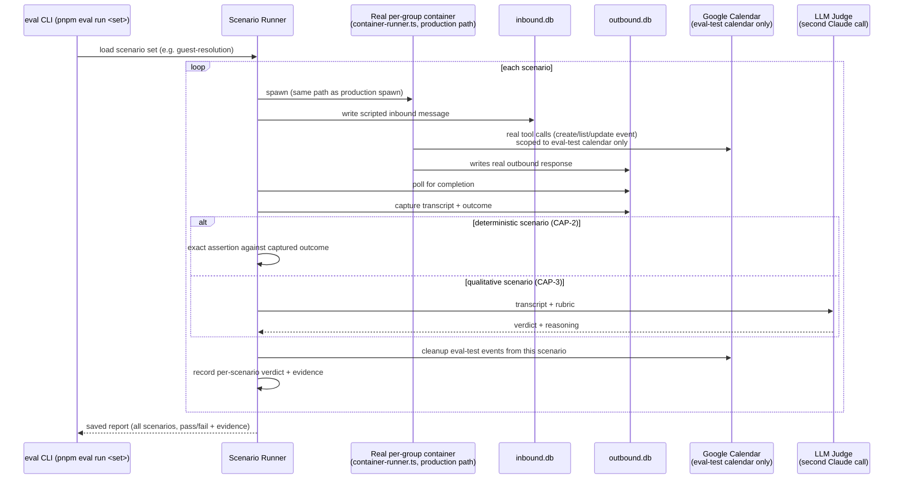

# Eval Harness — Flow

How one scenario run moves through the system, end to end (CAP-1..CAP-4).

## Why the real container, not a shortcut

Every live bug epic-2 actually found in production (the MCP-subprocess `loadConfig()` gap, the per-group memory isolation gap, the mount-allowlist rejection, the persona-doc `add_calendar` discoverability gap) lived in the container/DB/composition layer — none of them would have been caught by calling the Claude Agent SDK directly with a hand-assembled prompt. The real spawn path is the point.
